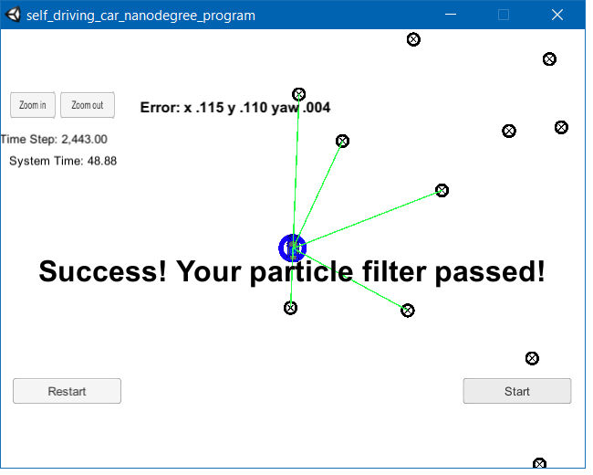

# Overview

This repository contains the code needed for a 2 dimensional particle filter in C++. The particle filter will be given a map and some initial localization information (analogous to what a GPS would provide). At each time step the filter will also get observation and control data.

The project was created with the Udacity [Starter Code](https://https://github.com/udacity/CarND-Kidnapped-Vehicle-Project).
It involves the Term 2 Simulator which can be downloaded [here](https://github.com/udacity/self-driving-car-sim/releases).

## Content of this repo
- `scr` a directory with the project code.
```
root
|   
|___src
    |   helper_functions.h
    |   main.cpp
    |   map.h
    |   particle_filter.cpp
    |   particle_filter.h
```
  - `main.cpp` -  This file contains the code that will actually be running your particle filter and calling the associated methods.
  - `helper_functions.cpp` - contains some helper functions for the 2D particle filter.
  - `particle_filter.cpp`- initializes the particle filter, performs particle predictions, updates weights and resamples the particles.

## Results
Here is a screenshot showing the results after running the simulator for the map data.




## References
The code in this project was adapted from the Localization course, which was part of Udacity's Self-Driving Car Nanodegree program.
